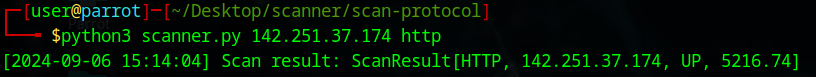

# Network Scanner Python3

A Python-based network scanner that checks the availability and response time of various protocols such as HTTP, HTTPS, FTP, and SSH on a given destination. This tool helps in identifying whether a server is up or down and calculates the response time for different protocols.

## Features

- Supports scanning of HTTP, HTTPS, FTP, and SSH protocols.
- Calculates response time for each protocol.
- Logs scan results with a timestamp for easier tracking.
- Lightweight and simple to use.

## How It Works

The network scanner connects to the specified destination and checks if the service is available for the given protocol. It uses `socket` to establish connections and measures the time it takes to receive a response.

### Supported Protocols

- **HTTP (Port 80)**
- **HTTPS (Port 443)**
- **FTP (Port 21)**
- **SSH (Port 22)**


## Installation

To use this tool, you'll need Python 3.x installed on your machine. Then, clone this repository and run the script.

```bash
git clone https://github.com/yourusername/network-scanner.git
cd network-scanner
```


## Get Started

Install Requirements

```bash
python3 -r requirements.txt
```

Run the script
`142.251.37.174` -> google.com
```bash
python3 scanner.py 142.251.37.174 http
```



### Other Protocols
- **https**
- **http**
- **ftp**
- **ssh**
